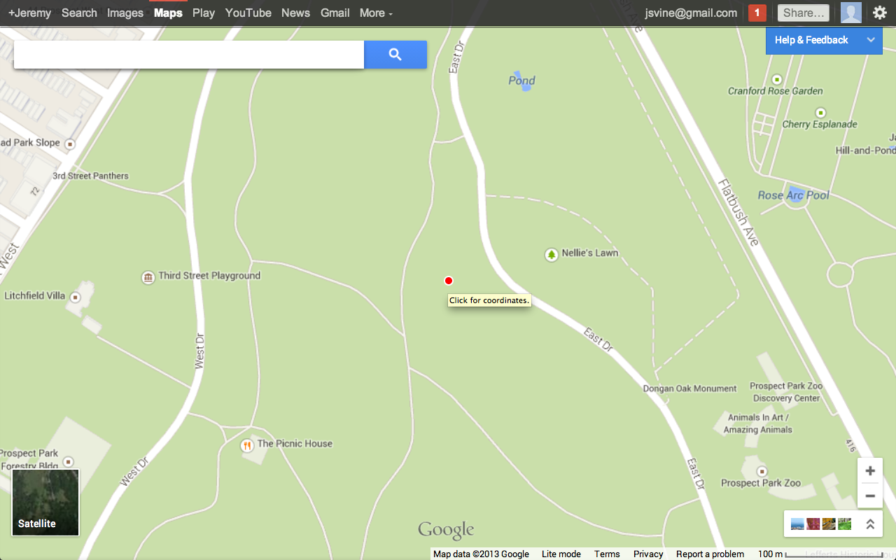
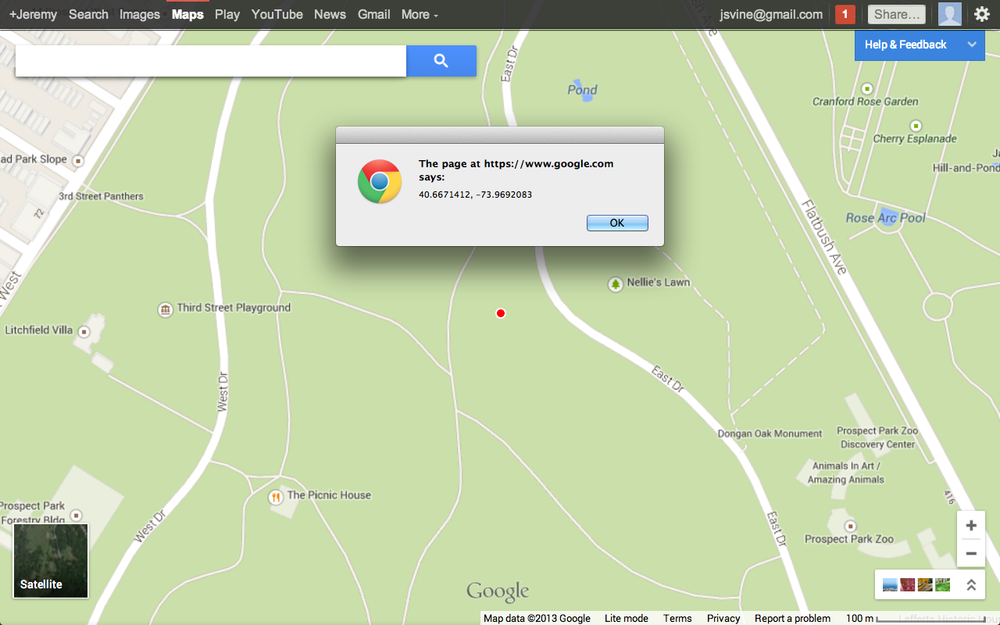

# Glat/Glong

Glat/Glong is a Chrome extension for finding the precise latitude and longitude of a point on Google Maps. 

The extension adds a red dot at the center of the map. Clicking the dot reveals the center's coordinates. Glat/Glong works on both the new ("preview") and old versions Google Maps.

__Mac/Linux users__: Coordinates will appear in an `alert` popup, as well as in the Chrome developer console.

__Windows users__: Coordinates will appear in the Chrome developer console.

## Install

For the latest release, [install Glat/Glong from the Chrome Web Store](https://chrome.google.com/webstore/detail/glatglong/meaobcmdlboddjbegokabeiikckmkpli).

For the most recent build, clone this repository to your computer, and follow Google's [instructions for loading unpacked extensions](http://developer.chrome.com/extensions/getstarted.html#unpacked).

## Privacy

Glat/Glong does not collect any data, or share your data or actions with anybody.

Glat/Glong does not load any "external" resources, such as analytics scripts, Facebook widgets, et cetera.
